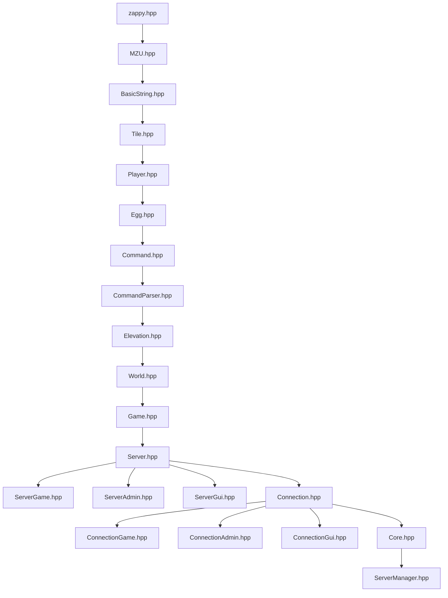

# Zappy - Testing & Usage Guide

This guide explains how to build, run, and test the **Zappy** server and client.

---

## 1. Project Architecture & Ports

The server binary (`./server`) runs three logical services configured in `server/zappy.conf`:

| Service | Default Port | Protocol | Description |
| :--- | :--- | :--- | :--- |
| **Game Server** | `4242` | TCP (Plaintext) | Handles AI player bots (`client` or `nc`) |
| **Admin Server** | `4243` | TCP (TLS / SSL) | Secure administration and monitoring endpoint |
| **GUI Server** | `4244` | TCP (Plaintext) | Streams live world snapshots and game notifications |

In addition, the server features an in-process **Raylib debug window** that renders the grid and resources in real-time.

---

### 1.1. Server Architecture



## 2. Compilation

From the root directory:

```bash
# Generate SSL certificates for the admin server (required once)
make certs

# Build both server and client
make

# Or compile individually
make server
make client
```

---

## 3. Running the Server

From the root directory:

```bash
./server/server server/zappy.conf
```

Or from the `./server` directory:

```bash
cd ./server
./server zappy.conf
```

You can also pass log-level flags before the config file to control verbosity:
```bash
# Available levels: debug, info, warn, error, fatal
./server/server info warn error fatal server/zappy.conf
```

> [!NOTE]
> Raylib opens a graphical debug window rendering the grid and resources in real-time.

---

## 4. Testing the Game Client

The AI client (`./client/client`) automatically connects to the server, completes the handshake, scans the world, collects food/stones, and levels up via incantations.

### Client Command-line Usage:
```bash
./client/client -n <team_name> -p <port> [-h <hostname>]
```

- `-n`: Team name (must match one defined in `server/zappy.conf`, e.g., `TeamRed` or `TeamBlue`)
- `-p`: Game server port (e.g., `4242`)
- `-h`: Host address (optional, default: `localhost`)

### Test Case 1: Connect a Single Client
From the root directory:
```bash
./client/client -n TeamRed -p 4242
```

Or from the `./client` directory:
```bash
cd ./client
./client -n TeamRed -p 4242
```
**Expected behavior:**
1. Receives `BIENVENUE` from the server.
2. Sends `TeamRed`.
3. Receives remaining slots count and world dimensions (e.g., `10 10`).
4. Begins sending commands (`voir`, `inventaire`, `avance`, `prend ...`).

### Test Case 2: Multi-Client Team Match
To test multiple players competing or cooperating, launch multiple clients across tabs or in the background from the root directory:

```bash
# Spawn 2 bots for TeamRed
./client/client -n TeamRed -p 4242 &
./client/client -n TeamRed -p 4242 &

# Spawn 2 bots for TeamBlue
./client/client -n TeamBlue -p 4242 &
./client/client -n TeamBlue -p 4242 &
```

To stop all background clients at once:
```bash
killall client
```

---

## 5. Manual Testing with Netcat (`nc`)

You can act as a player manually by connecting via `nc` to port `4242`.

```bash
nc 127.0.0.1 4242
```

### Handshake Sequence:
```text
< BIENVENUE
> TeamRed
< 3
< 10 10
```

### Supported Player Commands:
Once authenticated, send any of the following commands (press Enter):

| Command | Arguments | Server Response | Description |
| :--- | :--- | :--- | :--- |
| `avance` | none | `ok` | Move forward 1 tile |
| `droite` | none | `ok` | Turn 90° right |
| `gauche` | none | `ok` | Turn 90° left |
| `voir` | none | `[nourriture, ..., player, ...]` | Inspect vision cone |
| `inventaire` | none | `[nourriture N, linemate N, ...]` | Check inventory items |
| `prend` | `<objet>` | `ok` / `ko` | Pick up item (`nourriture`, `linemate`, `sibur`, etc.) |
| `pose` | `<objet>` | `ok` / `ko` | Drop item on current tile |
| `expulse` | none | `ok` / `ko` | Push players off current tile |
| `broadcast` | `<texte>` | `ok` | Broadcast sound to all players |
| `incantation` | none | `elevation en cours` -> `niveau actuel : K` / `ko` | Begin leveling ritual |
| `fork` | none | `ok` | Lay an egg to increase team capacity |
| `connect_nbr`| none | `<slots>` | Check unused connection slots for team |

---

## 6. Testing the Admin TLS Server (Port 4243)

The Admin server requires TLS/SSL. Test it with `openssl s_client` or `ncat`:

### Option A: Using OpenSSL
```bash
openssl s_client -connect 127.0.0.1:4243 -quiet
```
Type any message and press Enter; the server will process the TLS handshake and log the input.

### Option B: Using Makefile Shortcut
From the root directory:
```bash
make connect
```
*(Requires `ncat` installed: `sudo apt install -y ncat`)*

---

## 7. Testing the GUI Server (Port 4244)

Connect with `nc` to observe live notifications and world events:

```bash
nc 127.0.0.1 4244
```

Whenever actions happen in the game (such as egg hatching, player movements, or resource collection), the GUI server pushes event updates to connected clients.

---

## 8. Summary Checklist for Verification

- [ ] `server/certs/server.crt` & `server.key` generated (`make certs`).
- [ ] Server builds cleanly with `-Werror` and AddressSanitizer (`make` or `make server`).
- [ ] Client builds cleanly (`make` or `make client`).
- [ ] Server starts and listens on ports `4242`, `4243`, and `4244`.
- [ ] Single bot `./client/client -n TeamRed -p 4242` runs without crashes or leaks.
- [ ] Multiple bots can join both `TeamRed` and `TeamBlue`.
- [ ] Team slot limit is respected (max `clients_per_team` in `server/zappy.conf`).
- [ ] Player dies when food drops to 0 (`mort` notification).
- [ ] Admin TLS handshake succeeds with `openssl s_client`.
